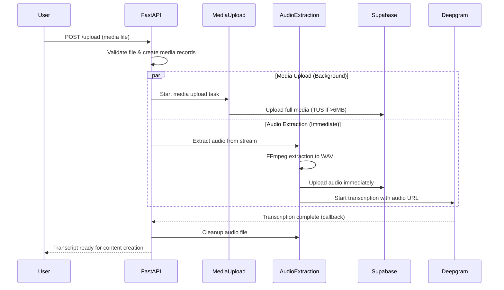
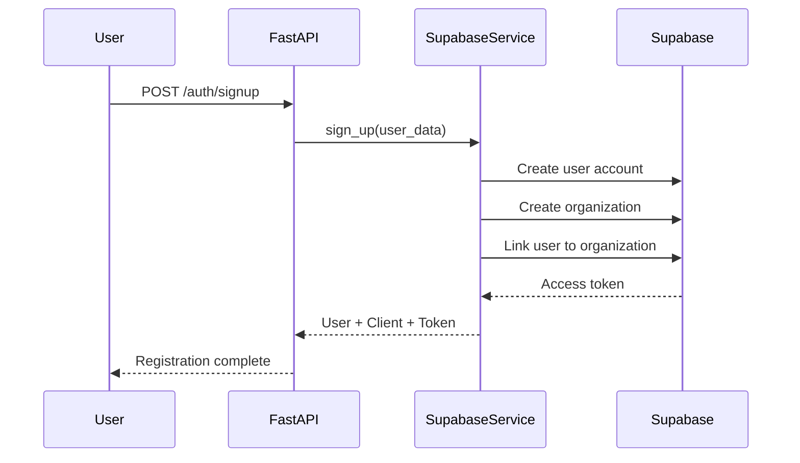

# SermonAI Backend Onboarding Guide

**Created:** December 26, 2024  
**Branch:** `develop`  
**Last Updated:** June 30, 2025 - Authentication & Authorization System documented, Supabase auth role strategy established

---

## Table of Contents
1. [System Architecture Overview](#system-architecture-overview)
2. [Codebase Structure](#codebase-structure)
3. [Key Services Deep Dive](#key-services-deep-dive)
4. [Authentication & Authorization System](#authentication--authorization-system)
5. [Data Flow Examples](#data-flow-examples)
6. [Development Patterns](#development-patterns)
7. [Testing Architecture](#testing-architecture)
8. [Configuration & Environment](#configuration--environment)

---

## System Architecture Overview

### High-Level System Diagram
```
┌─────────────────┐    ┌─────────────────┐    ┌─────────────────┐
│   Frontend      │    │   FastAPI       │    │   Supabase      │
│   (Future)      │───▶│   Backend       │───▶│   Database +    │
│                 │    │                 │    │   Storage       │
└─────────────────┘    └─────────────────┘    └─────────────────┘
                               │
                               ▼
                       ┌─────────────────┐
                       │   Deepgram      │
                       │   Transcription │
                       │   Service       │
                       └─────────────────┘
```

### Core Mission
**SermonAI transforms large sermon content into usable resources for churches:**
- **Input:** Raw sermon videos, audio files, or documents (4GB-40GB, 30-90 minutes)
- **Processing:** Audio extraction → Transcription → Content generation
- **Output:** Transcripts, social media posts, clips, sermon outlines

### Tech Stack Summary

**Backend Framework:**
- **FastAPI** - Modern Python web framework with automatic OpenAPI docs
- **Uvicorn** - ASGI server for FastAPI
- **Pydantic** - Data validation and serialization

**Database & Storage:**
- **Supabase** - PostgreSQL database with built-in storage
- **Supabase Storage** - File storage for videos and audio files

**AI/ML Services:**
- **Deepgram** - Speech-to-text transcription service
- **OpenAI GPT** - Content generation and processing

**File Upload:**
- **TUS Protocol** - Resumable uploads for large video files
- **Standard HTTP Upload** - For smaller files (<6MB)

**Infrastructure:**
- **Python 3.12** - Runtime environment
- **FFmpeg** - Audio/video processing
- **AsyncIO** - Asynchronous programming throughout

### Key Business Workflows

**1. Pastor's Journey:**
```
Pastor uploads sermon video → Gets transcript in minutes → Creates social content
```

**2. System Data Flow:**
```
Media Upload → Audio Extraction (concurrent) → Transcription → Content Generation → Delivery
```

---

## Codebase Structure

### Directory Layout
```
sermon_ai/
├── app/                          # Main application code
│   ├── main.py                   # FastAPI app entry point
│   ├── api/                      # API layer
│   │   ├── endpoints/            # Route handlers
│   │   │   ├── auth.py           # User authentication
│   │   │   ├── transcription.py  # Core upload/transcription logic
│   │   │   ├── content.py        # AI content generation
│   │   │   ├── clients.py        # Organization management
│   │   │   └── health.py         # Health checks
│   │   └── router.py             # API route aggregation
│   ├── services/                 # Business logic layer
│   │   ├── supabase_service.py   # Database/storage operations
│   │   ├── deepgram_service.py   # Transcription service
│   │   ├── audio_extraction_service.py # NEW: Audio extraction
│   │   ├── content_service.py    # AI content generation
│   │   ├── validation_service.py # File validation
│   │   ├── tus_upload_service.py # Large file uploads
│   │   └── classifier_service.py # Content classification
│   ├── models/                   # Data models
│   │   └── schemas.py            # Pydantic models for API
│   ├── config/                   # Configuration
│   │   └── settings.py           # Environment-based settings
│   ├── middleware/               # Request middleware
│   │   └── auth.py               # JWT authentication
│   └── core/                     # Core utilities (currently empty)
├── tests/                        # Test suite
│   ├── test_quick_flow.py        # End-to-end integration tests
│   ├── test_audio_extraction_service.py # Unit tests for audio service
│   └── test_concurrent_upload_flow.py   # Integration tests for concurrent processing
├── migrations/                   # Database migrations
├── run.py                        # Server startup script
├── run_quick_test.py            # Quick test runner
└── README.md                    # Project documentation
```

### Key Entry Points

**1. Application Startup:**
- `run.py` - Starts the FastAPI server
- `app/main.py` - FastAPI app configuration and middleware setup

**2. API Routes:**
- `app/api/endpoints/transcription.py` - Core upload and transcription endpoints
- `app/api/endpoints/auth.py` - User authentication and registration

**3. Business Logic:**
- `app/services/` - All business logic is encapsulated in service classes

---

## Key Services Deep Dive

### 1. SupabaseService (`app/services/supabase_service.py`)

**Purpose:** Central hub for all database and storage operations

**Key Responsibilities:**
- User management (signup, signin, profiles)
- Organization/client management
- Media (videos, audio, documents) and transcript CRUD operations
- File upload routing (standard vs TUS)

**Available Methods:**
```python
# User Operations
async def sign_up(user: UserCreate) -> User
async def sign_in(email: str, password: str) -> Dict[str, Any]
async def get_user(user_id: UUID) -> Optional[User]

# Media Operations (videos, audio, documents)
async def create_media(media: MediaCreate, user_id: UUID) -> Media
async def get_user_media(user_id: UUID) -> List[Media]
async def get_client_media(client_id: UUID) -> List[Media]
# Backward compatibility aliases:
# create_video(), get_user_videos()

# Transcript Operations
async def create_transcript(transcript: TranscriptCreate, user_id: UUID) -> Transcript
async def update_transcript(transcript_id: UUID, updates: Dict, user_id: UUID) -> Transcript

# File Upload
async def upload_file_with_smart_routing(file, bucket_name, storage_path, file_size, size_threshold)
```

**Storage Patterns:**
- Uses direct Supabase client for storage operations
- Smart routing: <6MB = standard upload, >6MB = TUS resumable upload
- Generates signed URLs for secure file access

### 2. DeepgramService (`app/services/deepgram_service.py`)

**Purpose:** Handles speech-to-text transcription via Deepgram API

**Key Responsibilities:**
- File validation (ensures audio streams exist)
- Direct file upload to Supabase storage
- Deepgram transcription job management
- Callback URL configuration

**Available Methods:**
```python
async def transcribe_from_url(signed_url: str) -> Dict[str, Any]
async def upload_to_supabase(file, content_type: str, storage_path: str) -> str
def _validate_audio(file: BinaryIO) -> bool
```

**Transcription Configuration:**
- Model: Nova-3 with smart formatting
- Features: Punctuation, speaker diarization, callbacks
- Callback endpoint: `/api/v1/transcription/callback`

### 3. AudioExtractionService (`app/services/audio_extraction_service.py`) 🆕

**Purpose:** Extract audio from video files for faster transcription

**Key Responsibilities:**
- Extract WAV audio using FFmpeg
- Upload audio immediately to Supabase storage
- Generate signed URLs for Deepgram
- Cleanup temporary and storage files

**Available Methods:**
```python
async def extract_and_upload_audio(video_stream, client_id, video_id) -> Tuple[str, str]
async def cleanup_audio_file(audio_storage_path: str) -> None
```

**FFmpeg Configuration:**
- Format: WAV (optimal for Deepgram)
- Quality: 16-bit PCM, 44.1kHz, stereo
- Output: Temporary files cleaned up automatically

### 4. ValidationService (`app/services/validation_service.py`)

**Purpose:** Comprehensive file validation before processing

**Key Responsibilities:**
- File type validation
- Size limit enforcement
- Audio stream detection via FFmpeg
- Content type verification

### 5. TUSUploadService (`app/services/tus_upload_service.py`)

**Purpose:** Resumable uploads for large video files (>6MB)

**Key Responsibilities:**
- TUS protocol implementation
- Upload progress tracking
- Resume interrupted uploads
- Integration with Supabase storage

---

## Authentication & Authorization System

### 🔐 System Overview

SermonAI implements a **production-ready multi-tenant authentication system** with:
- **Three-tier auth strategy** (Anon Key, Service Role, User-Authenticated)
- **Row Level Security (RLS)** for database-level data isolation
- **Comprehensive audit trails** with automatic triggers
- **Client-based multi-tenancy** ensuring churches can't see each other's data

### 🎯 Key Concepts (High Level)

#### **Auth Role Strategy**
```python
# User operations (viewing their data, uploads, etc.)
client = await self.create_user_authenticated_client(access_token, refresh_token)

# System operations (webhooks, admin tasks, storage)
client = await self._get_service_client()

# Public operations (signup, signin)
client = await self._get_anon_client()
```

#### **API Endpoint Pattern**
```python
@router.post("/endpoint")
async def endpoint(auth: AuthContext = Depends(get_auth_context)):
    # auth.user provides user info
    # auth.access_token provides authentication context
    return await service.method(auth.user.id, auth.access_token)
```

#### **Multi-Tenant Security**
- **RLS policies** ensure users only see their organization's data
- **Audit triggers** automatically track who created/modified what
- **Client isolation** prevents cross-organization data access

### 🛡️ Security Status: **PRODUCTION READY**

✅ **RLS enabled** on all business tables  
✅ **Audit triggers** installed and tested  
✅ **Multi-tenant isolation** verified  
✅ **User context preservation** throughout system  
✅ **Service role restrictions** properly implemented

### 📚 **For Complete Details**

**👉 See [SUPABASE_DATABASE_GUIDE.md](./SUPABASE_DATABASE_GUIDE.md) for:**
- Complete RLS policy documentation
- Database schema and relationships  
- Audit trigger implementation details
- Auth role decision matrices
- Troubleshooting and verification queries
- Security implementation deep dive

### 🚨 **Quick Developer Guidelines**

#### **When Writing New Code:**
1. **User-initiated operations** → Use `AuthContext` and pass `access_token`
2. **System/admin operations** → Use service role client
3. **Never manually set audit fields** → Let database triggers handle them
4. **Test with RLS enabled** → Verify data isolation works

#### **Common Patterns:**
```python
# ✅ CORRECT: User operation with proper auth
async def get_user_media(user_id, access_token, refresh_token=None):
    client = await self.create_user_authenticated_client(access_token, refresh_token)
    return await client.table('media').select('*').execute()

# ✅ CORRECT: System operation  
async def webhook_callback(data):
    client = await self._get_service_client()
    return await client.table('transcripts').update(data).execute()
```

**🔍 For troubleshooting auth issues, debugging queries, and implementation details, always refer to the [Supabase Database Guide](./SUPABASE_DATABASE_GUIDE.md).**

---

## Data Flow Examples

### 1. Media Upload & Transcription Flow (Concurrent Processing)



### 2. User Authentication Flow



### 3. File Upload Smart Routing

```python
# In SupabaseService.upload_file_with_smart_routing()
if file_size <= size_threshold:  # 6MB default
    return await self._upload_file_standard(file, bucket, path)
else:
    return await self._upload_file_tus(file, bucket, path)
```

---

## Development Patterns

### Service Layer Architecture

**Pattern:** Each service is a singleton with clear responsibilities
```python
# Example: DeepgramService
class DeepgramService:
    def __init__(self):
        self.client = DeepgramClient(settings.DEEPGRAM_API_KEY)
        self.supabase = create_client(...)

# Singleton instance
deepgram_service = DeepgramService()
```

### Error Handling

**Pattern:** Custom exceptions with HTTP status mapping
```python
class SupabaseServiceError(Exception):
    """Base exception for SupabaseService errors"""

class AudioExtractionError(Exception):
    """Raised when audio extraction fails"""

# In endpoints:
try:
    result = await some_service.method()
except ServiceError as e:
    raise HTTPException(status_code=502, detail=str(e))
```

### Async/Await Throughout

**Pattern:** All I/O operations are async
```python
async def upload_endpoint():
    video = await supabase_service.create_video(...)
    result = await deepgram_service.transcribe_from_url(...)
    return result
```

### Configuration Management

**Pattern:** Environment-based settings with defaults
```python
# app/config/settings.py
class Settings:
    SUPABASE_URL: str = os.getenv("SUPABASE_URL")
    DEEPGRAM_API_KEY: str = os.getenv("DEEPGRAM_API_KEY")
    TUS_THRESHOLD: int = int(os.getenv("TUS_THRESHOLD", "6291456"))  # 6MB

settings = Settings()
```

### Database Schema Patterns

**Multi-tenancy:** Client-based organization structure
```python
# Core entities
User -> belongs to -> Client (Organization)
Media -> belongs to -> Client  # Renamed from Video (supports video/audio/docs)
Transcript -> belongs to -> Media + Client

# Soft deletes with tracking
deleted_at: Optional[datetime] = None
deleted_by: Optional[UUID] = None

# Backward compatibility maintained via aliases:
# VideoCreate = MediaCreate, Video = Media
```

---

## Testing Architecture

### Test Structure

**3-Tier Testing:**
1. **Unit Tests** - Individual service methods in isolation
2. **Integration Tests** - Service interactions and workflows  
3. **End-to-End Tests** - Full API workflows with real services

### Test Files Overview

**1. `run_quick_test.py` / `tests/test_quick_flow.py`**
- Complete user journey testing
- Real service integration
- Manual execution for quick verification

**2. `tests/test_audio_extraction_service.py`**
- Unit tests for audio extraction functionality
- Mocked dependencies
- Error handling verification

**3. `tests/test_concurrent_upload_flow.py`**
- Integration tests for concurrent processing
- Service interaction testing
- Flow verification

### Testing Patterns

**Mock External Services:**
```python
with patch('app.services.supabase_service.supabase_service') as mock_supabase:
    mock_supabase.upload_file_to_storage = AsyncMock()
    # Test logic here
```

**Real File Testing:**
```python
# Tests prioritize test_audio.mp4 (44MB) for realistic but fast testing
test_files = [
    ("test_audio.mp4", "video/mp4"),    # Preferred
    ("test_audio.mp3", "audio/mpeg"),   # Fallback
    ("1gb_test_file.mp4", "video/mp4"), # Large file testing
]
```

---

## Configuration & Environment

### Required Environment Variables

**Supabase:**
```bash
SUPABASE_URL=https://your-project.supabase.co
SUPABASE_ANON_KEY=eyJ...  # Public anon key
SUPABASE_SERVICE_ROLE_KEY=eyJ...  # Admin service key
```

**Deepgram:**
```bash
DEEPGRAM_API_KEY=your-deepgram-key
CALLBACK_URL=https://your-domain.com/api/v1/transcription/callback
```

**Storage:**
```bash
STORAGE_BUCKET=videos  # Supabase storage bucket name
STORAGE_PATH_PREFIX=clients  # File organization prefix
TUS_THRESHOLD=6291456  # 6MB threshold for resumable uploads
```

**Authentication:**
```bash
JWT_SECRET_KEY=your-secret-key
JWT_ALGORITHM=HS256
ACCESS_TOKEN_EXPIRE_MINUTES=30
```

### Service Endpoints

**Production Patterns:**
- Health check: `GET /health`
- API docs: `GET /docs` (auto-generated by FastAPI)
- Main API: `/api/v1/*`

### Development Commands

**Start Server:**
```bash
python run.py
# or
uvicorn app.main:app --reload --host 0.0.0.0 --port 8000
```

**Run Tests:**
```bash
# Quick end-to-end verification
python run_quick_test.py

# Unit tests
pytest tests/test_audio_extraction_service.py -v

# All tests
pytest tests/ -v
```

---

## Recent Updates & Architecture Changes

### Media Table Rename (June 2025)

**What Changed:**
- Database table renamed from `videos` to `media` 
- Expanded content type support: videos, audio files, and documents
- Updated Pydantic models: `VideoCreate` → `MediaCreate`, `Video` → `Media`
- Maintained full backward compatibility via aliases
- Updated all service methods to use media terminology

**Migration Details:**
- Zero downtime migration executed
- All existing data preserved
- API endpoints maintain same paths for backward compatibility
- Content type validation expanded to support sermon documents

**Benefits:**
- Multi-content support (not just videos)
- Future-ready for document processing
- Cleaner terminology aligned with business model

### Why This Tech Stack?

**FastAPI:** Modern Python framework with automatic API documentation and async support

**Supabase:** PostgreSQL + Storage + Auth in one platform, reducing infrastructure complexity

**Deepgram:** Best-in-class speech recognition with callback support for async processing

**TUS Protocol:** Industry standard for resumable uploads, critical for large media files

**Service Layer Pattern:** Clear separation of concerns, testable business logic

### Key Design Principles

**1. Async First:** All I/O operations use async/await for better performance

**2. Service Isolation:** Each external integration wrapped in a dedicated service

**3. Multi-tenant Ready:** Client-based data isolation from day one

**4. Fail Fast:** Comprehensive validation before expensive operations

**5. Observable:** Detailed logging throughout for debugging and monitoring

---

## Getting Started Checklist

### For New Developers

- [ ] Clone repository and install dependencies (`pip install -r requirements.txt`)
- [ ] Set up environment variables (copy from team lead)
- [ ] Install FFmpeg (`brew install ffmpeg` on macOS)
- [ ] Get `test_audio.mp4` file for testing
- [ ] Run `python run_quick_test.py` to verify setup
- [ ] Start server with `python run.py`
- [ ] Visit `http://localhost:8000/docs` for API documentation

### For Understanding the Codebase

1. **Start with:** `app/main.py` to understand FastAPI setup
2. **Then read:** `app/api/endpoints/transcription.py` for core business logic
3. **Explore services:** Start with `supabase_service.py` and `deepgram_service.py`
4. **Test understanding:** Run unit tests and see how services are mocked
5. **Try the flow:** Use `run_quick_test.py` to see the complete user journey

---

## Production Readiness Checklist

### Database Schema
- [x] Media table rename completed
- [x] Backward compatibility aliases in place
- [x] Content type validation supports sermon documents
- [x] Foreign key constraints updated
- [x] Indexes optimized for media queries

### API Compatibility  
- [x] All existing endpoints work with new schema
- [x] Response formats unchanged for clients
- [x] Error handling preserved
- [x] Authentication and authorization intact

### Testing Coverage
- [x] End-to-end flow tests passing
- [x] Real audio transcription verified
- [x] Race condition fixes tested
- [x] Concurrent processing working
- [x] Database migration tested

### Performance
- [x] Concurrent audio extraction operational
- [x] TUS resumable uploads for large files
- [x] Audio cleanup after transcription
- [x] Background video processing

### Authentication System Implementation
- [x] Service method categorization completed
- [x] User-authenticated client patterns implemented
- [x] API endpoints updated with AuthContext
- [x] System operation patterns established  
- [x] Webhook callback handling implemented
- [x] Comprehensive documentation completed

**System Status:** ✅ Production Ready

---

**End of Onboarding Guide**  
*Last Updated: June 30, 2025 - Authentication system implementation completed, all API endpoints updated*  
*This document reflects the current production state. Always check git history for recent changes.*